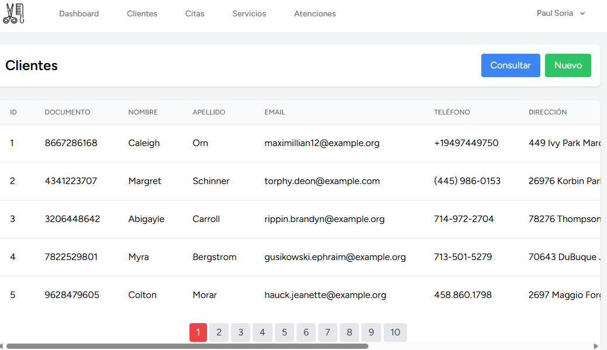
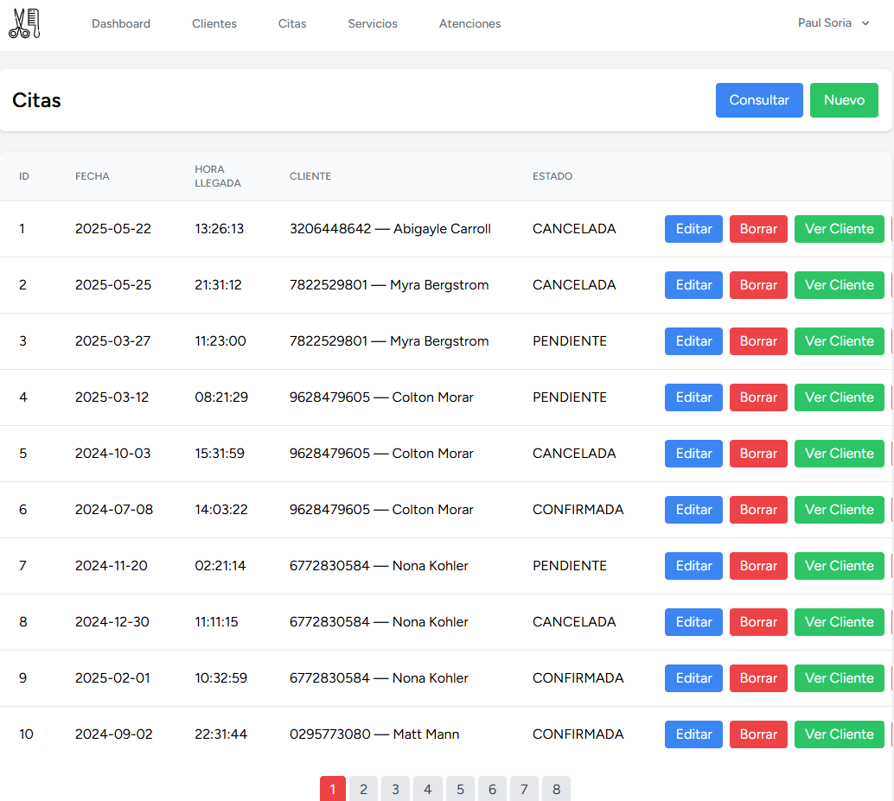
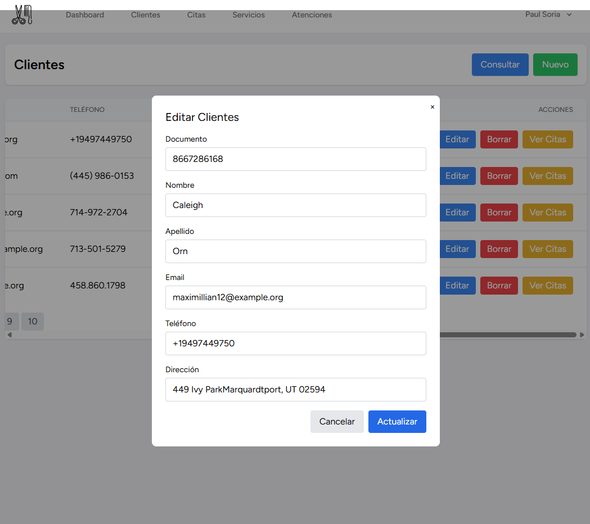
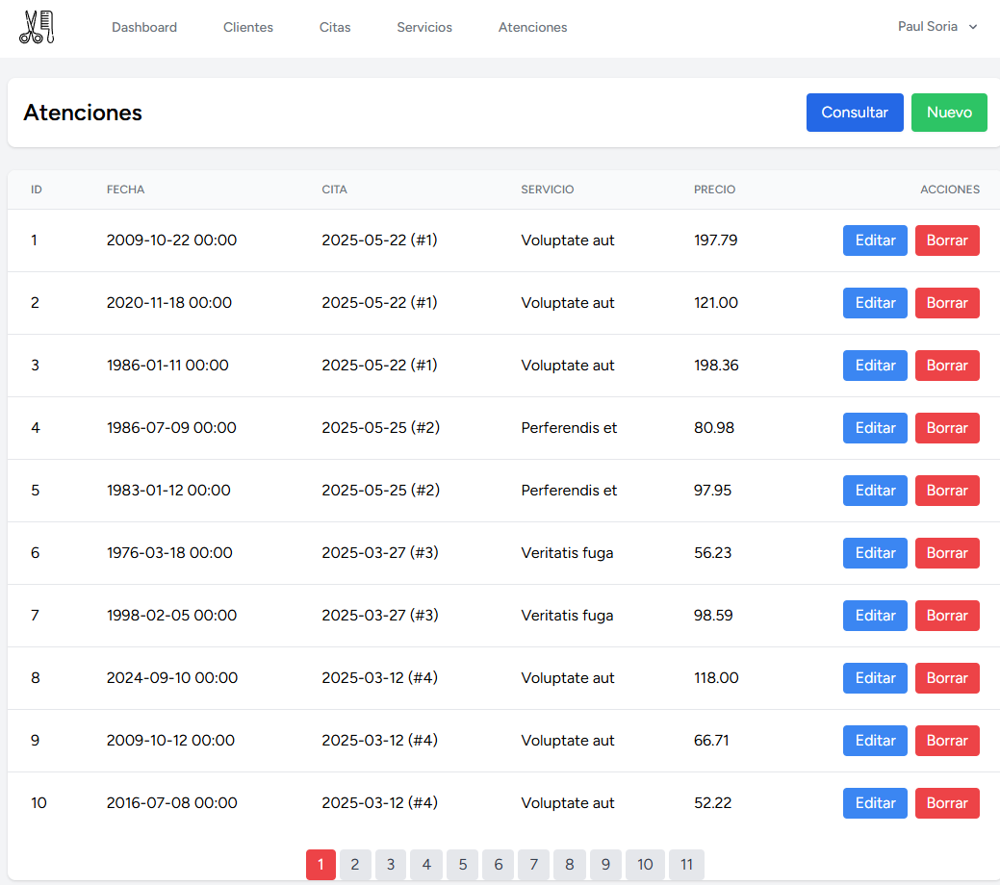
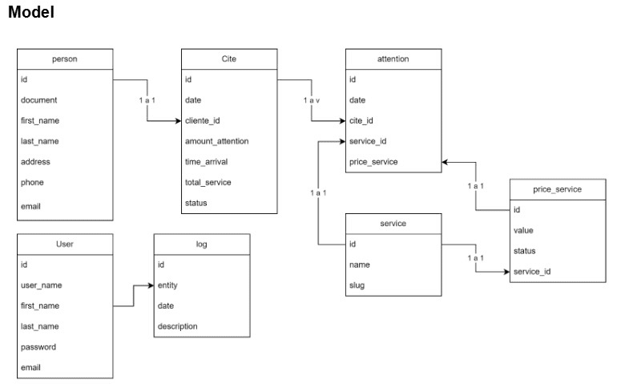

# Peluquería Anita

A web system to **manage clients, appointments, and services performed** for a hair salon.  
It helps you control the **agenda** (appointments) and keep a history of **services provided** (attentions), with **authentication**, **system user management**, and **action logging (audit log)**.

> **Users ≠ Clients**  
> **Users** are the people who log in and operate the system (staff/admin).  
> **Clients** are the salon customers being attended.

---

## 🧱 Tech Stack

- **Backend:** Laravel 12  
- **Authentication:** Laravel Breeze  
- **Full-stack SPA:** Inertia.js + Vue 3  
- **Build:** Vite  
- **Styles:** Tailwind CSS  
- **Database:** MySQL (SSL CA required)  
- **Containers:** Docker (PHP 8.2 + Node.js 20)

---

## 🧩 Main Features

- **Authentication & security** (Laravel Breeze)
- **System users management** (create/manage users that operate the app)
- CRUD modules:
  - **Clients**
  - **Appointments**
  - **Services**
  - **Attentions** (services performed to a client, typically linked to an appointment)
  - **Service Prices** (if enabled in your flow; stored historically via `price_service`)
- **Audit Log** (entity, date, description)

---

## 🧠 Business Flow & Relationships

- A **Client** can have **many Appointments**
- An **Appointment** can have **many Attentions**
- Each **Attention** belongs to **one Service** (and stores the applied price at that time)
- Services can have multiple prices over time (historical price changes)

---

## Screenshots










---

## 🔧 Requirements

- Docker
- A `.env` file with your environment configuration
- Access to a MySQL database **with SSL CA** (cloud provider)

---

## ⚙️ Environment Setup (`.env`)

1. Clone this repository and go to the project root.
2. Create a `.env` file (minimum example below).

### ✅ Important notes before you copy/paste

- **Set `APP_URL` with protocol + port** (recommended for Docker):
  - `APP_URL=http://localhost:10000`
- **Do not set `ASSET_URL=localhost`**  
  If you set `ASSET_URL` incorrectly, your browser may request assets like:
  `/localhost/build/assets/...` (404 Not Found)

### Minimal `.env` example

```dotenv
APP_ENV=local
APP_DEBUG=true

# IMPORTANT: include protocol and port
APP_URL=http://localhost:10000

# IMPORTANT: do NOT set this to "localhost"
# Leave it empty or commented unless you really need it.
# ASSET_URL=

SANCTUM_STATEFUL_DOMAINS=localhost:10000
CACHE_DRIVER=file
SESSION_DOMAIN=localhost

# Path to the SSL certificate (created by start.sh from MYSQL_ATTR_SSL_CA_B64)
MYSQL_ATTR_SSL_CA=/usr/src/app/storage/certs/ca.pem

# Laravel app encryption key (must be valid base64:...)
APP_KEY=base64:TU_APP_KEY_AQUI=

DB_CONNECTION=mysql
DB_HOST=TU_HOST
DB_PORT=TU_PUERTO
DB_DATABASE=defaultdb
DB_USERNAME=TU_USUARIO
DB_PASSWORD=TU_CONTRASEÑA

# Test admin user created by migration insert_test_admin_user (if present)
ADMIN_TEST_NAME="Admin Pruebas"
ADMIN_TEST_EMAIL="admin@example.com"
ADMIN_TEST_PASSWORD="admin1234"

# SSL CA certificate in Base64 (no line breaks)
MYSQL_ATTR_SSL_CA_B64=TU_CERT_BASE64
# Note: MYSQL_ATTR_SSL_CA_B64 must be your ca.pem encoded in Base64 (single line, no line breaks)
```

## 🔑 About `APP_KEY` (Laravel)
The `APP_KEY` is a **secret encryption key** used by Laravel to encrypt/sign sensitive data (cookies, sessions, encrypted values, signed URLs, etc.).
It **must be valid** and should not be changed once the app is in use (changing it will invalidate encrypted data and sessions).
Generate a key locally (prints it without editing files):
```bash
php artisan key:generate --show
```

Copy the output into:
```dotenv
APP_KEY=base64:<YOUR_KEY_HERE>
```

## 🗄️ Database (Cloud MySQL + SSL CA)
This project is designed to connect to **cloud MySQL** instance that requires **SSL**.
Without the SSL CA certificate (and correct connection config), the project **will not connect.**

## ✅ Recommended (Docker): store CA as Base64 in `.env`
- Put your CA certificate in `MYSQL_ATTR_SSL_CA_B64` (single line, no breaks).
- On container startup, `start.sh` decodes it and writes it to: `storage/certs/ca.pem`

## Convert `ca.pem` to Base64 (single line)
Linux:
```bash
base64 -w 0 ca.pem
```

macOS:
```bash
base64 ca.pem | tr -d '\n'
```

Windows (PowerShell):
```powershell
[Convert]::ToBase64String([IO.File]::ReadAllBytes("user/relative/path/to/ca.pem"))
```

Paste the resulting into `.env`:
```dotenv
MYSQL_ATTR_SSL_CA_B64=PASTE_HERE
```
Tip: When using `docker run --env-file .env`, avoid wrapping the Base64 value in quotes.
Prefer: `MYSQL_ATTR_SSL_CA_B64=...` (no `"..."`)

## If you are NOT using Docker (not recommended)
1. Create the folder: `storage/certs`
2. Copy your `ca.pem` into: `storage/certs/ca.pem`
3. Set in `.env` (absolute or relative path):
```dotenv
MYSQL_ATTR_SSL_CA=/path/to/ca.pem
```

## 🗺️ Database Diagram


Relationship summary (based on the diagram):
- `person (client)` 1 - N `cite (appointment)`
- `cite (appointment)` 1 - N `attention (attention)`
- `service (service)` 1 - N `price_service (service price)`
- `attention (attention)` references `cite` + `service` and stores `price_service`
- `log` stores audit entries (entity, date, description)
- `user` represents system operators (login accounts)

## 🐳 Run with Docker
From the project root:
```bash
# 1) Build the image
sudo docker build -t peluqueria-anita .

# 2) Run (port 10000)
sudo docker run --rm --env-file .env -p 10000:10000 peluqueria-anita
```

## What `start.sh` does inside the container
- Creates `storage/certs/`
- Decodes `MYSQL_ATTR_SSL_CA_B64` → `storage/certs/ca.pem`
- Caches Laravel config/routes/views
- Starts Laravel: `php artisan serve --host=0.0.0.0 --port=10000`
If you change `.env`, you must restart the container so cached config uses the latest values.
---
## 🚀 Technologies Used (Table)
| Layer                 | Technology                              |
| --------------------- | --------------------------------------- |
| **Backend**           | Laravel 12                              |
| **Authentication**    | Laravel Breeze                          |
| **Full-stack SPA**    | Inertia.js + Vue 3                      |
| **Build & Dev**       | Vite                                    |
| **CSS**               | Tailwind CSS                            |
| **Bundling & Assets** | laravel-vite-plugin, @vitejs/plugin-vue |
| **DB**                | MySQL (SSL CA injected by Docker)       |
| **Containers**        | Docker (PHP 8.2-FPM, Node.js 20)        |

## 📒 Workflow
1. Backend (Laravel) serves Inertia routes.
2. Frontend (Vue 3) renders pages/components using data provided by controllers (Eloquent).
3. Breeze provides login/registration and route protection.
4. Docker bundles PHP, Node and all dependencies for consistent local/prod execution.

## 🧰 Troubleshooting
### 1) Assets 404 with `/localhost/build/assets/...`
Symptoms (browser console/network):
- `GET http://localhost:10000/localhost/build/assets/... 404`
Cause:
- `ASSET_URL=localhost` (or missing protocol in `APP_RUL`) causes invalid asset URLs.
Fix:
- Use `APP_URL=http://localhost:10000` and leave `ASSET_URL` empty/commented: `# ASSET_URL=`

Restart the container after changes

### 2) MySQL SSL error: `Cannot connect to MySQL using SSL`
Most common causes:
- `MYSQL_ATTR_SSL_CA_B64` is not valid Base64, contains line breaks, spaces, or quotes
- CA file is not correctly generated in `storage/certs/ca.pem`
Checks (inside container):
```bash
ls -l storage/certs/ca.pem
head -n 2 storage/certs/ca.pem
```
Expected: first line should contain `-----BEGIN CERTIFICATE-----`

## 🔒 Security Notes
- Never commit your `.env` file
- Keep `APP_KEY` secret and stable
- Protect DB credentials and CA certificate contents (even in Base64)